# School_District_Analysis

## Overview of the school district analysis
The students_complete.csv file shows evidence of academic dishonesty; specifically, reading and math grades for Thomas High School ninth grades appear to have been altered. This project is to replace the math and reading scores for Thomas High School with NaNs while keeping the rest of the data intact. The school district analysis is then performed again and a report is written to describe how the changes affects the overall analysis.

## Results

### How is the district summary affected?
Before replacing the ninth grade math and reading scores with NaN at Thomas High School, the district summary are as follows:
- Average Math Score: 79.0
- Average Reading Score: 81.9
- % Passing Math: 75
- % Passing Reading: 86
- % Overall Passing: 65

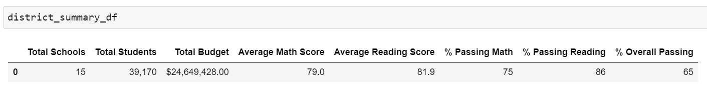

After replacing the ninth grade math and reading scores with NaN at Thomas High School, the district summary are as follows:
- Average Math Score: 78.9
- Average Reading Score: 81.9
- % Passing Math: 74.8
- % Passing Reading: 85.8
- % Overall Passing: 64.9

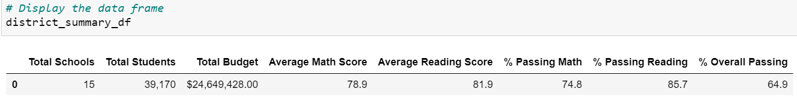

As a result, the average math score, % passing math, % passing reading, and the % overall passing slightly dropped.

### How is the school summary affected?
Before replacing the ninth grade math and reading scores with NaN at Thomas High School, the school summary is shown in the picture below:

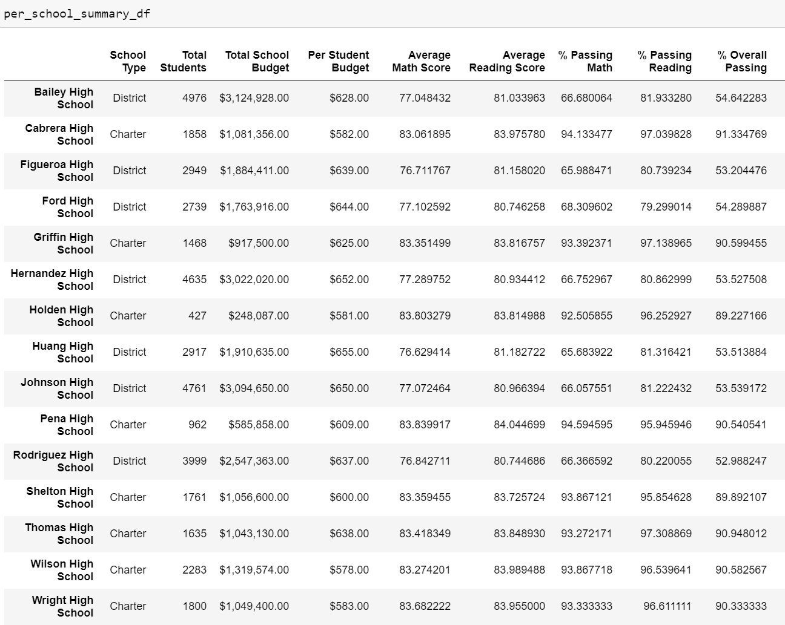

After replacing the ninth grade math and reading scores at Thomas High School with NaN, the school summary is shown in the picture below:

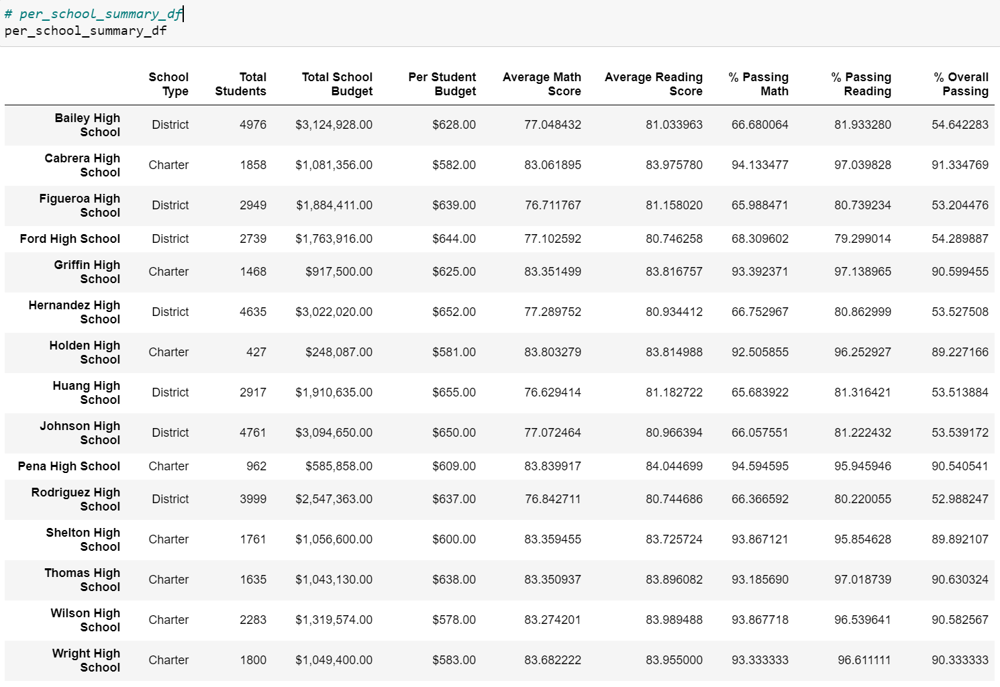

As a result, the school summary did not have a significant change, where there is only a slight change in numbers at Thomas High School, since the changes only applied to ninth graders at Thomas High School, in which the changes will be discussed in the next section.

### How does replacing the ninth graders' math and reading scores affect Thomas High Schools' performance?
Before replacing the ninth grade math and reading scores with NaN at Thomas High School, the school summary, specifically, for Thomas High School are as follows:

- Average Math Score: 83.418349
- Average Reading Score: 83.848930
- % Passing Math: 93.272171
- % Passing Reading: 97.308869
- % Overall Passing: 90.948012

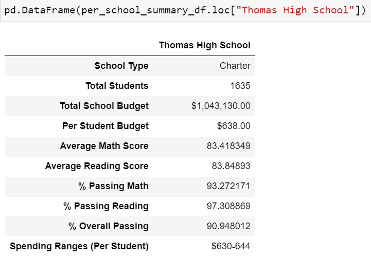

After replacing the ninth grade math and reading scores with NaN at Thomas High School, the school summary, specifically, for Thomas High School are as follows

- Average Math Score: 83.350937
- Average Reading Score: 83.896082
- % Passing Math: 93.185690
- % Passing Reading: 97.018739
- % Overall Passing: 90.630324

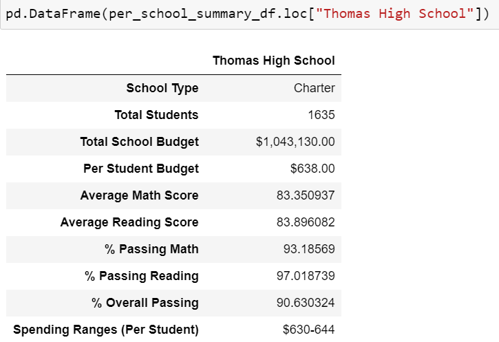

As a result, the average reading score slightly increased, while the average math score, % passing math, % passing reading, and % overall passing slightly dropped.

### How does replacing the ninth-grade scores affect the following:
- Math and reading scores by grade
    - As in the picture shown below, the math scores for the 9th graders at Thomas High School has been replaced with NaN. This contributed to the changes discussed above regarding Thomas High School's performance.

    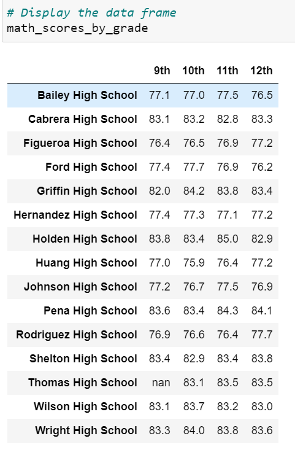

    - The same applies to reading scores for the 9th graders at Thomas High School, which has been replaced with NaN. This also contributed to the changes discussed above regarding Thomas High School's performance.

    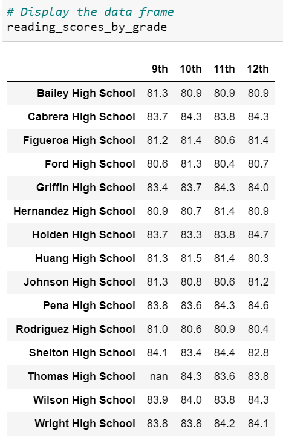

- Scores by school spending
    - The scores by school spending before making changes to the math and reading scores for ninth graders at Thomas High School is shown in the picture below:

    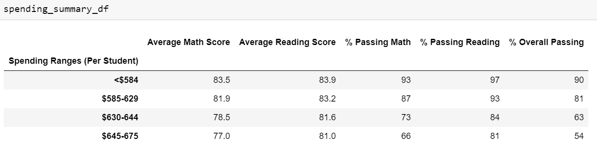

    - The scores by school spending after making changes to the math and reading scores for ninth graders at Thomas High School is shown in the picture below:

    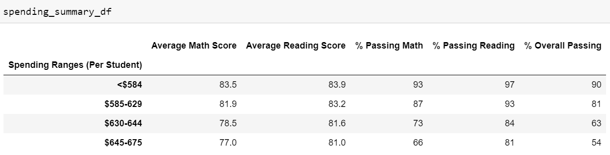

    As a result, there is no change to the spending summary.

- Scores by school size
    - The scores by school size before making changes to the math and reading scores for ninth graders at Thomas High School is shown in the picture below:
    
    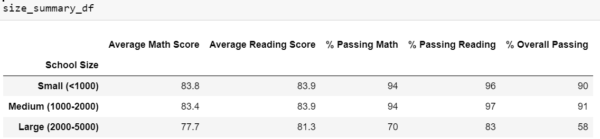

    - The scores by school size after making changes to the math and reading scores for ninth graders at Thomas High School is shown in the picture below:
    
    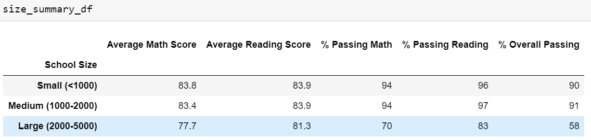

    As a result, there is no change to the size summary.

- Scores by school type
    - The scores by school type before making changes to the math and reading scores for ninth graders at Thomas High School is shown in the picture below:
    
    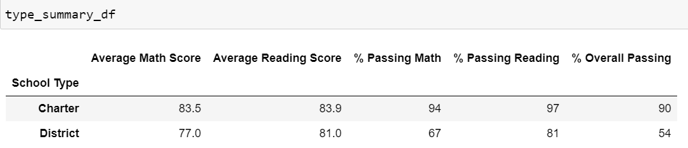

    - The scores by school type after making changes to the math and reading scores for ninth graders at Thomas High School is shown in the picture below:
    
    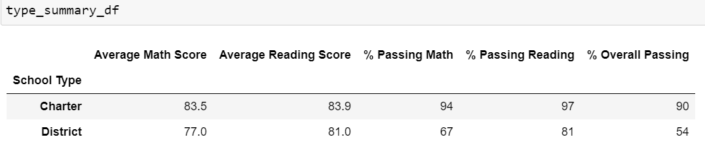

    As a result, there is no change to the type summary.

## Summary

As a result of replacing the math and reading scores for ninth graders at Thomas High School with NaN, the district summary's average math score, % passing math, % passing reading, and the % overall passing slightly dropped. In terms of school summary, it is shown that there is only a slight change in the numbers at Thomas High School, since the changes only applied to the ninth graders at Thomas High School. In terms of Thomas High School's performance, it's average reading score slightly increased, while the average math score, % passing math, % passing reading, and % overall passing slightly dropped. After replacing the ninth-grade scores at Thomas High School with NaN, there is no change to the school spending, school size, and school type summaries.
